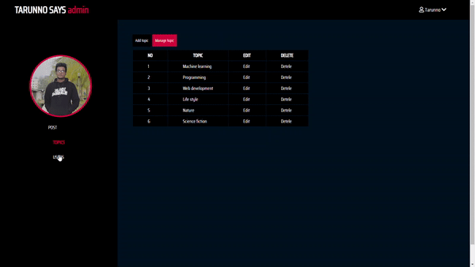

# Blog-PHP
I have used Procedural PHP for this project. I can create post, add image to the post, add topic tag. There's also have personal profile for every Author where everyone have personal profile picture, there previous post. 

## Admin panel

### For more views go to the Screen shots folder

The admin panel has 3 eidting option : users, posts and topic. The admin can remove a author and his/her posts, can add a Author also. Admin can publish or unpublish any post.
There's also a slide show, which consists of the trending posts. Admin can chose between posts and trending posts.

### Features : CURD and CMS
I have mainly used the concept of CURD and CMS in procedural php.
features: 
        1. add, delele update post, user and topic. 
        2. upload post image and profile picture. 
        3. rate, comoment in posts. 
        4. search posts. 
        5. admin panel for the admin to manage the contents. 
        6. form validations 

### Front-end Features :
In front a i have used vanilla-js for interactivity
and core html, css for markup and style.  
        1. Responsive.   
        2. Image slider for trending posts.  
        3. Tabs.  
        4. Scroll animation on srcoll-down. 
        5. Hamburger menu on mobile view . 
        6. XML http request. 
        7. CKeditor 5. 
              
### Languages : HTML CSS JavaScript PHP and SQL
I have used core HTML CSS JavaScript and PHP in this project. There's no framework used for any of these language.
For front-end I have used HTML CSS JS and for back-end I have used PHP SQL.
I have used XAMPP as local severe and phpMyadmin for Database managment system.

### Requirement : Import the DATABASE.sql file to your phpMyadmin 
